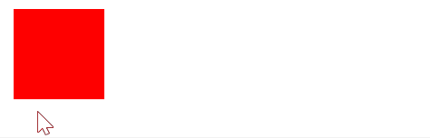

# HTML

## 关于height等需要设置长度的样式的属性
<table class="reference ">
<tbody><tr>
<th>值</th>
<th>描述</th>
</tr>

<tr>
<td>auto</td>
<td>默认。浏览器会计算出实际的高度。</td>
</tr>

<tr>
<td><i>length</i></td>
<td>使用 px、cm 等单位定义高度。</td>
</tr>

<tr>
<td><i>%</i></td>
<td>基于包含它的块级对象的百分比高度。</td>
</tr>

<tr>
<td>inherit</td>
<td>规定应该从父元素继承 height 属性的值。</td>
</tr>
</tbody></table>

## 关于块级对象的百分比高度
1. 如果父亲是flex组件，那么它直接变成flex父亲的对应长度？


## 实现鼠标悬停效果（多用于按键）
- 使用:hover(伪类？)
```css
<style>
    .test {
        width: 100px;
        height: 100px;
        background: red;
        transition: width 2s, background 2s;
    }
    .test:hover {
        width: 300px;
        background: yellow;
    }
</style>
```
上面的例子同时实现了动画过渡

## 实现css动画过渡
<blockquote style="border-color:#ae52f2">实现一些炫酷的效果只需要很简单的css代码</blockquote>

```css
<style>
    .test {
        width: 100px;
        height: 100px;
        background: red;
        transition: width 2s, background 2s;
    }
    .test:hover {
        width: 300px;
        background: yellow;
    }
</style>
```


## html列表
`ul` 无序标签， 标签内部每个item是`li`标签
`ol`有序标签， 内部也为`li`

### 如何去掉html列表中的序号头
在css样式中指定属性 list-style-type
<table class="reference ">

<tbody><tr>
<th>值</th>
<th>描述</th>
</tr>

<tr>
<td>none</td>
<td>无标记。</td>
</tr>

<tr>
<td>disc</td>
<td>默认。标记是实心圆。</td>

</tr><tr>
<td>circle</td>
<td>标记是空心圆。</td>
</tr>

<tr>
<td>square</td>
<td>标记是实心方块。</td>

</tr><tr>
<td>decimal</td>
<td>标记是数字。</td>
</tr>

<tr>
<td>decimal-leading-zero</td>
<td>0开头的数字标记。(01, 02, 03, 等。)</td>

</tr><tr>
<td>lower-roman</td>
<td>小写罗马数字(i, ii, iii, iv, v, 等。)</td>
</tr>

<tr>
<td>upper-roman</td>
<td>大写罗马数字(I, II, III, IV, V, 等。)</td>

</tr><tr>
<td>lower-alpha</td>
<td>小写英文字母The marker is lower-alpha (a, b, c, d, e, 等。)</td>
</tr>

<tr>
<td>upper-alpha</td>
<td>大写英文字母The marker is upper-alpha (A, B, C, D, E, 等。)</td>

</tr><tr>
<td>lower-greek</td>
<td>小写希腊字母(alpha, beta, gamma, 等。)</td>
</tr>

<tr>
<td>lower-latin</td>
<td>小写拉丁字母(a, b, c, d, e, 等。)</td>

</tr><tr>
<td>upper-latin</td>
<td>大写拉丁字母(A, B, C, D, E, 等。)</td>
</tr>

</tr>
</tbody></table>

所以设置list-style-type为none即可

### ps
- 有时候还顺便去除一下li标签前面距离/padding：
padding:0px;


## 去除显示下划线： 
`text-decoration:none;`

## 常用组件: textarea
- rows: 多少行的高度
- placeholder 
- form* 定义所属的表单（id)
  - 这个还挺方便的，因为不用被form标签包裹，可以继承非form元素的css样式
    有时候会忘记设置form的css样式


### 如何在textarea中输入tab
```java
// 处理编辑区按下tab键会转移到下一个组件不能输入tab符号的问题
textarea.addEventListener('keydown', function(event) {
    if (event.key === 'Tab') {
        event.preventDefault(); // Prevent the default tab action

        let start = this.selectionStart;
        let end = this.selectionEnd;

        if (start === end) {
            // Insert tab at single cursor position
            document.execCommand('insertText', false, "  ");
        } else {
            // Handle multi-line tab insertion
            let strBefore = this.value.slice(0, start);
            let curLineStart = strBefore.lastIndexOf('\n') + 1;
            let strBetween = this.value.slice(curLineStart, end);
            let newStr = "  " + strBetween.replace(/\n/g, '\n  ');

            this.setSelectionRange(curLineStart, end);
            document.execCommand("insertText", false, newStr);

            // Adjust selection range after insertion
            let lineBreakCount = strBetween.split('\n').length;
            let newStart = start + 2;
            let newEnd = end + lineBreakCount * 2;

            this.setSelectionRange(newStart, newEnd);
        }
    }
});
```
- Q: execommand api过时了吗？
  - 其实不是。没有替代方案。如果你要做一个文本编辑器应用。


## `<header>`标签
理论上可以用div块替代，但是用了header可以
- 提高网站的可访问性和结构性
- 有利于搜索引擎对内容的识别，用于SEO多一些


用于展示
- 徽标
- 导航栏
- 简单介绍


## html中如何使用svg
1. 直接用`img`标签，src指向svg的path。推荐
  e.g. 
```html

```

2. 直接放svg标签


## 隐藏滚动条：
- IE浏览器
对于IE，我们需要使用-ms-prefix属性定义滚动条样式：

```html
-ms-overflow-style: none; /* IE 10+ */
```

- Firefox浏览器
对于Firefox，我们可以将滚动条宽度设置为none：

```html
scrollbar-width: none; /* Firefox */
```

- Chrome和Safari浏览器
对于Chrome和Safari浏览器，我们必须使用CSS滚动条选择器，然后使用display：none隐藏它：
```
::-webkit-scrollbar {
  display: none; /* Chrome Safari */
}
```
注意：当你要隐藏滚动条的时候，最好将overflow显示设置为auto或者scroll保证内容是可滚动的。

### 溢出文字显示省略号...
HTML超出文本显示省略号…
需要对div或者span同时应用Css： 
复制代码如下: 

```css
text-overflow:ellipsis; 
white-space:nowrap;
```

即可实现所想要得到的溢出文本显示省略号效果。
Q：怎么自动换行，这里不是很明白。
参考https://www.runoob.com/cssref/pr-text-white-space.html

## Url符号转义

https://www.runoob.com/tags/html-urlencode.html

## html符号转义

https://www.cnblogs.com/xcsn/p/3559624.html


<br><br><br><br><br><br><br><br><br><br><br><br><br><br><br><br><br><br>
end
